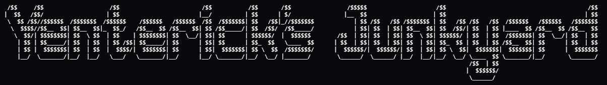

    

    
    
    
    

---

A terminal-based backend scaffolding tool written in Rust.

Generate project structures, models, controllers, routes, and other boilerplate code without leaving your terminal.
